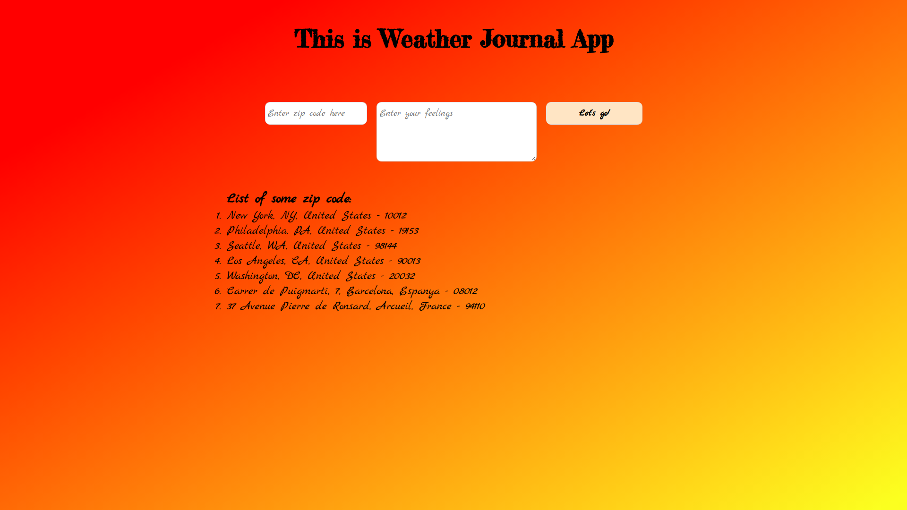
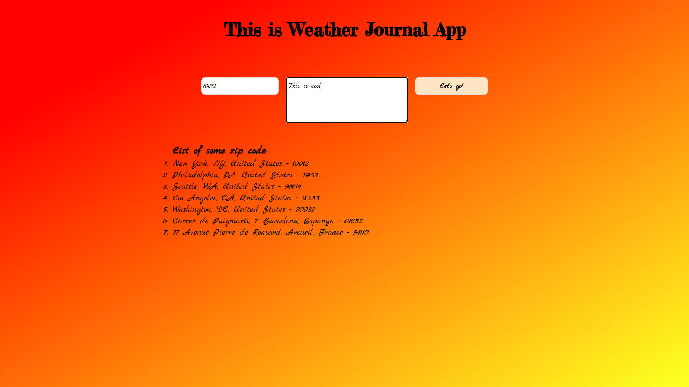
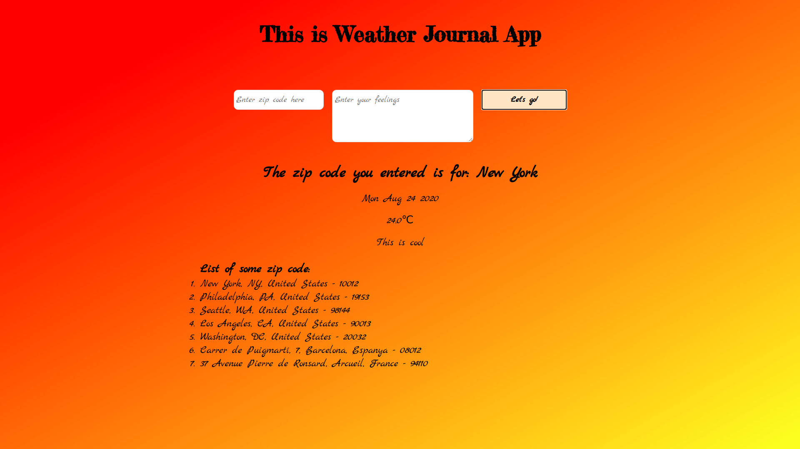

# Weather-Journal App Project

## Overview

This project requires you to create an asynchronous web app that uses Web API and user data to dynamically update the UI.

## Introduction

In this project are used:

- HTML
- CSS
- VanillaJS
- NodeJS
- ExpressJS
- Webpack

---

### Getting started

To view and test the project need to download in .zip format or clone it repository.
The next step is to navigate (in the terminal) to the corresponding directory in which it is located and install depedencies with

```
npm install
```

For the result to be obtained there must be credential for the API used in the project:

- **API_KEY** for [Openweathermap API](https://openweathermap.org/appid),

He is saved in `.env` file with:

- API_KEY for Openweathermap API

The next step is to execute the following command:

```
npm start
```

to start server and open in browser [Localhost](localhost:8000)

---

### Screenshots

---

<div align="center">

#### Homepage



---

#### Search with Zip code



---

#### Result of Search



</div>
